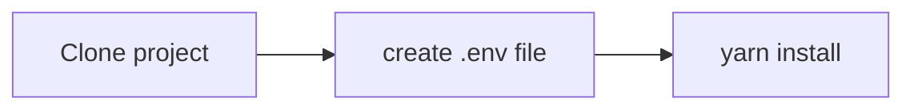

# Graphql Template By Module

The repo is setup project based on apollo-server with graphql and module structure with ES6 or greater

## Development

### Setup in local


```
git clone git@github.com:hunghkit/graphql-template-by-module.git
cd graphql-template-by-module
yarn install
```

###  Environment is required
- Nodejs
- Docker

### Basic command
- `yarn start` run the development environment
- `yarn dev` run the development environment with watch code
- `yarn build` compile the code ES6 via babel
- `yarn test` run basic test

### Note:
- Need to run  `docker-compose up -d` to init mongodb env in your project in first time run project

## License: MIT
